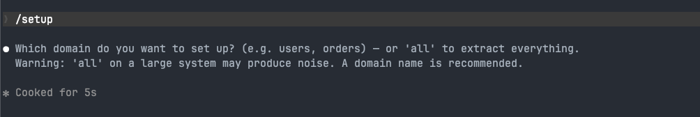
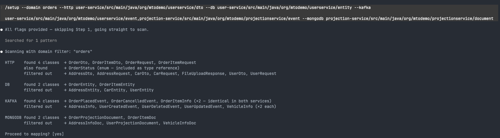
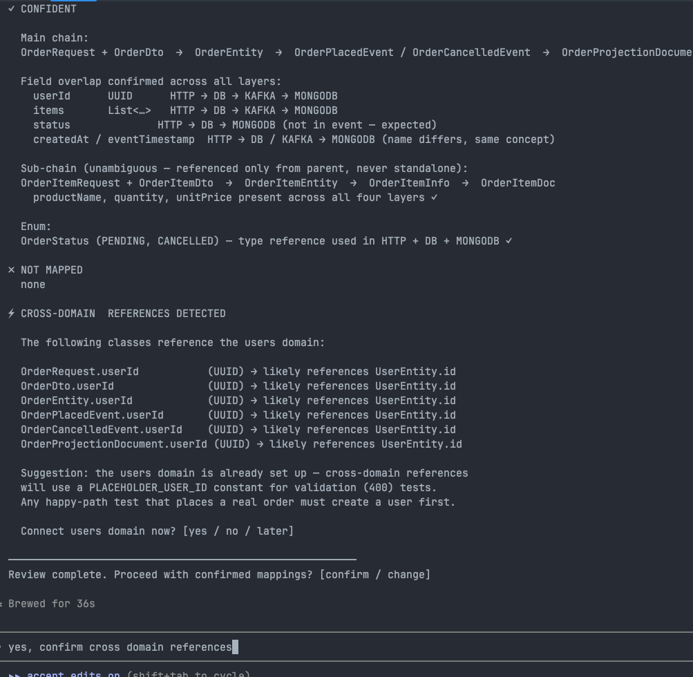
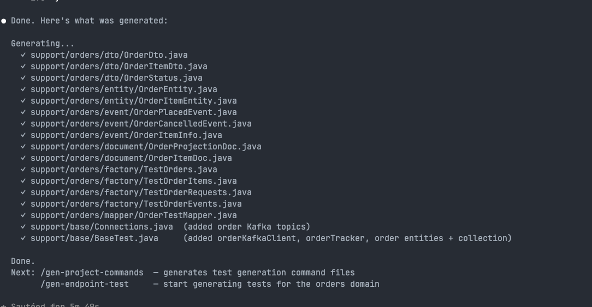
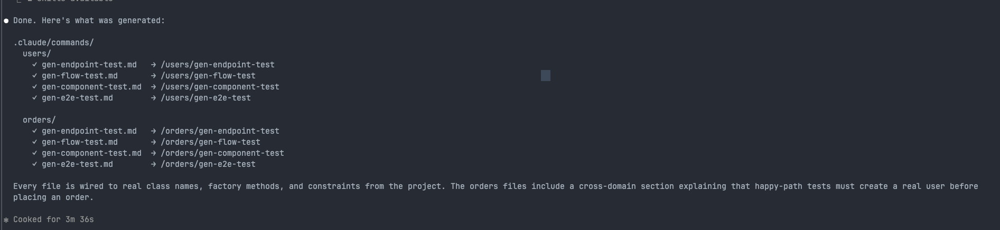
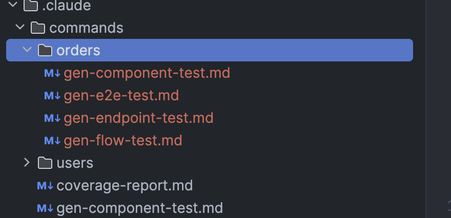
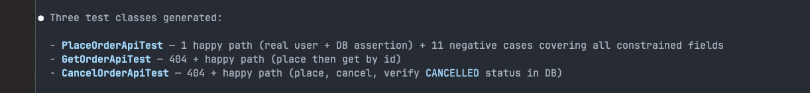
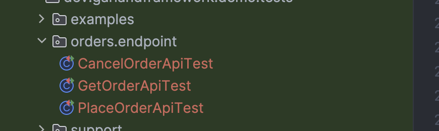

The demo ships with Claude Code slash commands that generate Garland tests. The orders domain — a fully implemented API with no tests — is the blank canvas to practice with.

## What you need

- [Claude Code](https://claude.ai/code) CLI or IDE extension (VS Code / JetBrains)
- The demo project open as your working directory

The generation commands are pre-installed in the repo at `.claude/commands/`. Claude Code picks them up automatically.

---

## How it works

The generation process has six steps, each building on the previous one.

**1. Scan sources and build the support layer** — `/setup` reads your DTOs, entities, events, and documents, maps them into a domain chain, detects cross-domain references, and generates mirrored test classes, factories, a mapper, and wires up `BaseTest` — all adapted for the test module without touching the service code.

**2. Generate domain-specific commands** — `/gen-project-commands` reads the generated support layer and produces four tailored slash commands per domain, pre-loaded with real class names, factory methods, field constraints, Kafka topics, and cross-domain setup patterns.

**3. Generate tests** — each domain command takes a plain-English description and produces a complete, compilable test class that matches the project style.

**4. Run and fix** — tests may not pass on the first run. Stack traces point to the exact issue; Claude fixes them in context, knowing the full project structure it built.

**5. Save what you learned** — update the `## Learned patterns` section in the command files with any quirks discovered during the fix loop. These notes are read automatically on every future generation run for that domain — the same way an engineer carries institutional knowledge of a codebase.

**6. Repeat** — the same flow applies to flow, component, and end-to-end tests.

---

## The orders domain

`user-service` has a complete orders API:

| Endpoint | Description |
|---|---|
| `POST /api/orders` | Place an order |
| `GET /api/orders/{id}` | Get order by ID |
| `PUT /api/orders/{id}/cancel` | Cancel an order |

`projection-service` consumes `order.placed` and `order.cancelled` Kafka events and builds order projection documents in MongoDB. The full stack is running — it just has no tests.

The users test suite is the reference for what good tests look like. The generation commands know the project layout, factories, mappers, clients, and rules — they produce output that matches the existing style.

---

## Walkthrough

### Step 1 — Run `/setup` to scan sources and build the orders support layer

Before generating any tests, the orders domain needs a support layer: mirrored DTOs, entities, events, documents, factories, and a mapper. The `/setup` command builds all of this by scanning your source code.

Run it from the demo project root in Claude Code with the full paths to each protocol:

```
/setup --domain orders \
  --http user-service/src/main/java/org/mtodemo/userservice/dto \
  --db user-service/src/main/java/org/mtodemo/userservice/entity \
  --kafka user-service/src/main/java/org/mtodemo/userservice/event,projection-service/src/main/java/org/mtodemo/projectionservice/event \
  --mongodb projection-service/src/main/java/org/mtodemo/projectionservice/document
```

You can also run `/setup` without flags — it will ask for the domain name and protocol paths interactively.



#### Scan

Setup scans each path and applies a domain filter — only classes whose name or package contains `orders` are kept. Everything else is reported as filtered out so you can confirm the right classes were picked up.



Type `yes` to proceed to mapping.

#### Mapping

Setup reads the fields in each class and maps them into a chain:

```
OrderRequest + OrderDto → OrderEntity → OrderPlacedEvent / OrderCancelledEvent → OrderProjectionDoc
```

For each mapping it reports its confidence level. If a mapping is unambiguous — consistent names, majority field overlap, clear parent/sub relationships — it is marked **✓ CONFIDENT** and proceeds automatically. If there are multiple candidates or low field overlap it stops and asks you to decide.

Setup also detects cross-domain references. Every order class contains a `userId` field that references the users domain. Setup flags this and notes that happy-path tests must create a real user first — the `PLACEHOLDER_USER_ID` constant is only valid for validation (400) tests where the service rejects before touching the database.



Type `confirm` to generate.

#### Generated files

Setup writes the full support layer for the orders domain:



It also patches the existing `BaseTest` and `Connections` without overwriting them — adding `orderKafkaClient`, `orderTracker`, the order Kafka topics, order entities to the Postgres wrapper, and the `order_projections` collection to the Mongo wrapper.

### Step 2 — Run `/gen-project-commands` to generate domain-specific slash commands

After the support layer is in place, run `/gen-project-commands`. It scans the entire test infrastructure — all clients, factories, mappers, request classes, validation constraints, and cross-domain dependencies — and generates four tailored command files per domain into `.claude/commands/<domain>/`.

```
/gen-project-commands
```

No arguments. It finds all domains automatically from the test module structure.

For the orders domain it produces:

| Command | Invocation |
|---|---|
| Endpoint tests | `/orders/gen-endpoint-test` |
| Flow tests | `/orders/gen-flow-test` |
| Component tests | `/orders/gen-component-test` |
| End-to-end tests | `/orders/gen-e2e-test` |

The same set is generated for the users domain under `/users/`.



Each file is pre-loaded with the real class names, factory methods, field constraints, Kafka topics, and cross-domain setup patterns for that specific domain — no template placeholders.



### Step 3 — Generate endpoint tests with `/orders/gen-endpoint-test`

With the domain commands in place, run the endpoint test generator. Each command takes a plain-English description of what to generate — class names, endpoints, and scope.

```
/orders/gen-endpoint-test PlaceOrderApiTest, GetOrderApiTest, CancelOrderApiTest — happy path + all validation and error cases for each endpoint
```

The command reads the constraint table, factory methods, cross-domain dependency rules, and reference test suite baked into the command file, then generates a complete, compilable test class per endpoint with no manual editing required.

**PlaceOrderApiTest** — covers `POST /api/orders`:
- Happy path: creates a real user first (cross-domain dependency), places an order, asserts 201 response matches request, verifies persistence in Postgres via `postgresClient.findByFields()`
- Null `userId` → 400
- Null and empty `items` list → 400
- Blank, null, and oversized `productName` → 400
- Null, zero, and negative `quantity` → 400
- Null, zero, and negative `unitPrice` → 400

**GetOrderApiTest** — covers `GET /api/orders/{id}`:
- Non-existent id → 404
- Happy path: places an order, retrieves by id, asserts response matches

**CancelOrderApiTest** — covers `PUT /api/orders/{id}/cancel`:
- Non-existent id → 404
- Happy path: places an order, cancels it, asserts 200 with `CANCELLED` status, verifies updated row in Postgres





### Fixing generated output

Generated code sometimes needs correction — a wrong return type, a missing import, a method signature that doesn't match the framework API. You don't need to fix these manually.

Just tell Claude what's wrong and it will fix it. Because `/setup` and `/gen-project-commands` already ran in the same session, Claude has full context: the actual class names, method signatures, client types, factory patterns, and framework constraints. It can diagnose and correct the issue the same way a developer would — by reading the affected file, understanding the mismatch, and applying a targeted fix.

In this walkthrough, `TestOrderRequests.cancelOrder()` was initially generated with the wrong return type (`HttpCallRequest<OrderDto>` instead of `HttpCallRequest<Void>`) because the cancel endpoint takes no request body. A single build pointed to the error, and asking Claude to fix it produced the correct result immediately — with an explanation of why: `HttpCallRequest<T>` represents the *request body* type, not the response type. The response type is always specified separately in `makeCall(200, OrderDto.class)`.

This loop — generate, build, fix — is fast because the context is already there.

### Step 4 — Run the tests and fix what fails

Generated tests may not pass on the first run. That is expected and not a problem — the fixes are quick because the full context is already in the session.

In this walkthrough, running the endpoint tests after generation surfaced two issues in the entity mirrors:

**Missing `@Column(name=...)` mappings.** Spring Boot applies a snake_case naming strategy at runtime, so `productName` becomes `product_name` in the database. The test `HibernateWrapper` does not apply this strategy, so camelCase fields that map to snake_case columns require an explicit `@Column(name = "product_name")` annotation. The same applied to `unitPrice`, `userId`, and `createdAt`.

**Lazy loading outside a session.** The `items` collection on `OrderEntity` was loaded lazily by default, which fails when accessed outside a Hibernate session. Adding `fetch = FetchType.EAGER` — the same pattern used by `UserEntity` — resolved it.

Both fixes were single-line changes. Claude identified them from the stack traces, knew exactly which entity fields to annotate, and applied the corrections without any manual investigation. The tests went from 0 passing to 17/17 in two iterations.

The generated support layer, factories, mappers, and command files give Claude all the guardrails it needs to fix issues accurately — it is not guessing, it is working from the actual project structure it built.

### Step 5 — Update the generation command files with what you learned

After fixing test failures, update the command files to record what you discovered. Every domain command file has a **Learned patterns** section at the bottom, empty at generation time and meant to be filled in as you work.

This is the same thing a real engineer does when they join a team — they note the quirks, the non-obvious mappings, the framework behaviours that bit them once and should never bite anyone again. The difference is that these notes are read automatically by Claude every time a generation command runs for that domain.

For the orders domain, after this walkthrough the learned patterns section in `orders/gen-endpoint-test.md` would be updated with:

```
## Learned patterns

- OrderItemEntity requires explicit @Column(name=...) for snake_case columns:
  productName → @Column(name = "product_name")
  unitPrice   → @Column(name = "unit_price")
  The test HibernateWrapper does not apply Spring Boot's naming strategy.

- OrderEntity also requires explicit mappings:
  userId    → @Column(name = "user_id")
  createdAt → @Column(name = "created_at")

- OrderEntity.items must use fetch = FetchType.EAGER — lazy loading
  fails when the collection is accessed outside a Hibernate session.

- HttpCallRequest<T> is the request body type, not the response type.
  GET and body-less PUT return HttpCallRequest<Void>.
  The response type is always specified in makeCall(200, OrderDto.class).
```

The next time anyone generates a test for the orders domain — a new endpoint, a new flow, a new team member — Claude reads these notes and gets it right from the start. No repeated debugging, no re-learning the same lessons.

---

### Step 6 — Repeat for flow, component, and end-to-end tests

The same process applies to the other three generation commands. Each one has its own domain-specific command file pre-loaded with the right factories, mappers, clients, and cross-domain setup patterns.

```
/orders/gen-flow-test OrderFlowTest — place then cancel lifecycle
/orders/gen-component-test OrderApiToKafkaTest — place order publishes event and persists to Postgres
/orders/gen-component-test KafkaToOrderProjectionTest — order event projected to MongoDB
/orders/gen-e2e-test OrderEndToEndTest — place and cancel order full chain
```

Generate, build, fix if needed, repeat.
